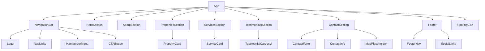

# Design Document: Royal Reality Website

## Overview

This design describes a static single-page React application for Royal Reality Groups — a premium real estate company. The website serves as a digital storefront conveying luxury branding (gold on dark theme) while providing property browsing, service information, client testimonials, and contact functionality.

The site is built as a greenfield project using React with Vite as the build tool, Tailwind CSS for styling, and Framer Motion for scroll-triggered animations. All content is static (hardcoded placeholder data) with no backend or CMS integration. The contact form performs client-side validation and simulates submission.

### Key Design Decisions

| Decision | Choice | Rationale |
|----------|--------|-----------|
| Framework | React 18 + Vite | Fast HMR, modern tooling, excellent static site support |
| Styling | Tailwind CSS 3 | Utility-first approach enables rapid responsive design with design tokens |
| Animations | Framer Motion | Declarative API, respects `prefers-reduced-motion`, IntersectionObserver-based |
| Form handling | React Hook Form | Lightweight validation, no dependencies on backend |
| Carousel | Custom hook | Avoids heavy carousel libraries; simple timer + state logic |
| Image format | WebP with `<picture>` fallback | Performance requirement (LCP < 3s) |
| Deployment | Static hosting (Vercel/Netlify) | No server required for static SPA |

## Architecture

The application follows a component-based architecture with a flat section layout typical of single-page marketing sites.



### Project Structure

```
src/
├── App.tsx
├── main.tsx
├── index.css                  # Tailwind directives + custom properties
├── components/
│   ├── NavigationBar/
│   │   ├── NavigationBar.tsx
│   │   ├── NavLinks.tsx
│   │   └── HamburgerMenu.tsx
│   ├── HeroSection/
│   │   └── HeroSection.tsx
│   ├── AboutSection/
│   │   └── AboutSection.tsx
│   ├── PropertiesSection/
│   │   ├── PropertiesSection.tsx
│   │   └── PropertyCard.tsx
│   ├── ServicesSection/
│   │   ├── ServicesSection.tsx
│   │   └── ServiceCard.tsx
│   ├── TestimonialsSection/
│   │   ├── TestimonialsSection.tsx
│   │   └── TestimonialCarousel.tsx
│   ├── ContactSection/
│   │   ├── ContactSection.tsx
│   │   ├── ContactForm.tsx
│   │   └── ContactInfo.tsx
│   ├── Footer/
│   │   └── Footer.tsx
│   ├── FloatingCTA/
│   │   └── FloatingCTA.tsx
│   └── shared/
│       ├── CTAButton.tsx
│       ├── SectionWrapper.tsx
│       └── AnimatedSection.tsx
├── hooks/
│   ├── useCarousel.ts
│   ├── useActiveSection.ts
│   └── useScrollTo.ts
├── utils/
│   ├── formatPrice.ts
│   ├── validateForm.ts
│   └── constants.ts
├── data/
│   ├── properties.ts
│   ├── services.ts
│   ├── testimonials.ts
│   └── companyInfo.ts
└── types/
    └── index.ts
```

## Components and Interfaces

### Core Type Definitions

```typescript
// types/index.ts

export interface Property {
  id: string;
  name: string;
  location: string;
  price: number;
  currency: string;
  image: string;
  bedrooms: number;
  bathrooms: number;
  areaSqFt: number;
}

export interface Service {
  id: string;
  title: string;
  description: string; // 20-150 characters
  icon: string;        // icon identifier
}

export interface Testimonial {
  id: string;
  clientName: string;  // max 50 characters
  reviewText: string;  // max 300 characters
  rating: number;      // 1-5
}

export interface ContactFormData {
  fullName: string;    // max 100 characters
  email: string;       // max 254 characters
  phone: string;       // max 15 digits
  message: string;     // max 1000 characters
}

export interface ValidationError {
  field: keyof ContactFormData;
  message: string;
}

export interface CompanyInfo {
  phone: string;
  email: string;
  address: string;
  socialLinks: {
    facebook: string;
    instagram: string;
    twitter: string;
    linkedin: string;
  };
}
```

### Key Component Interfaces

```typescript
// NavigationBar
interface NavigationBarProps {
  sections: { id: string; label: string }[];
}

// PropertyCard
interface PropertyCardProps {
  property: Property;
}

// ServiceCard
interface ServiceCardProps {
  service: Service;
}

// TestimonialCarousel
interface TestimonialCarouselProps {
  testimonials: Testimonial[];
  autoRotateInterval?: number; // default 5000ms
}

// ContactForm
interface ContactFormProps {
  onSubmit: (data: ContactFormData) => Promise<void>;
}

// CTAButton
interface CTAButtonProps {
  label: string;
  href?: string;
  onClick?: () => void;
  variant?: 'primary' | 'outline';
}

// AnimatedSection
interface AnimatedSectionProps {
  children: React.ReactNode;
  className?: string;
}
```

### Custom Hooks

```typescript
// useCarousel.ts
interface UseCarouselReturn {
  currentIndex: number;
  next: () => void;
  prev: () => void;
  goTo: (index: number) => void;
  pause: () => void;
  resume: () => void;
}
function useCarousel(itemCount: number, intervalMs: number): UseCarouselReturn;

// useActiveSection.ts
function useActiveSection(sectionIds: string[]): string | null;

// useScrollTo.ts
function useScrollTo(): (sectionId: string) => void;
```

### Utility Functions

```typescript
// formatPrice.ts
function formatPrice(amount: number, currency?: string): string;
// Example: formatPrice(1250000, "₹") => "₹12,50,000"
// Example: formatPrice(1250000, "$") => "$1,250,000"

// validateForm.ts
interface ValidationResult {
  isValid: boolean;
  errors: ValidationError[];
}
function validateContactForm(data: Partial<ContactFormData>): ValidationResult;
function isValidEmail(email: string): boolean;
function isValidPhone(phone: string): boolean;
```

## Data Models

### Static Data Structures

All data is hardcoded in TypeScript files under `src/data/`. No database or API is involved.

```typescript
// data/properties.ts
export const properties: Property[] = [
  {
    id: "prop-1",
    name: "Royal Palm Villa",
    location: "Palm Beach, Mumbai",
    price: 25000000,
    currency: "₹",
    image: "/images/properties/villa-1.webp",
    bedrooms: 4,
    bathrooms: 3,
    areaSqFt: 3500,
  },
  // ... minimum 6 properties
];

// data/services.ts
export const services: Service[] = [
  { id: "svc-1", title: "Property Buying", description: "Find your dream home with our expert guidance and curated listings.", icon: "home" },
  { id: "svc-2", title: "Property Selling", description: "Maximize your property value with our premium marketing strategies.", icon: "tag" },
  { id: "svc-3", title: "Rental Services", description: "Discover premium rental properties tailored to your lifestyle.", icon: "key" },
  { id: "svc-4", title: "Property Management", description: "Hassle-free property management with dedicated support.", icon: "building" },
  // 4-8 services
];

// data/testimonials.ts
export const testimonials: Testimonial[] = [
  // minimum 4 testimonials
];

// data/companyInfo.ts
export const companyInfo: CompanyInfo = {
  phone: "+91-XXXXXXXXXX",
  email: "info@royalrealitygroups.com",
  address: "123 Royal Avenue, Mumbai, Maharashtra, India",
  socialLinks: { ... }
};
```

### Design Tokens (Tailwind Config)

```typescript
// tailwind.config.ts
export default {
  theme: {
    extend: {
      colors: {
        brand: {
          gold: '#D4AF37',
          'gold-light': '#F4E29A',
          'gold-dark': '#B8860B',
          dark: '#1A1A2E',
          'dark-lighter': '#16213E',
          'dark-card': '#0F3460',
          cream: '#F5F5DC',
        }
      },
      fontFamily: {
        heading: ['Playfair Display', 'Georgia', 'serif'],
        body: ['Inter', 'system-ui', 'sans-serif'],
      },
      spacing: {
        // Base unit: 4px (Tailwind default)
        // All spacing derived from multiples of 4
      }
    }
  }
}
```

## Correctness Properties

*A property is a characteristic or behavior that should hold true across all valid executions of a system — essentially, a formal statement about what the system should do. Properties serve as the bridge between human-readable specifications and machine-verifiable correctness guarantees.*

### Property 1: Price formatting preserves value and includes separators

*For any* positive number and any currency symbol, `formatPrice(amount, currency)` SHALL produce a string that starts with the currency symbol, contains only digits and separator characters (commas or locale-specific grouping), and when the separators are stripped and the string is parsed back to a number, equals the original amount.

**Validates: Requirements 4.3**

### Property 2: Carousel index always stays within bounds

*For any* item count greater than zero and any sequence of `next`, `prev`, and `goTo(index)` operations applied to the carousel state, the `currentIndex` SHALL always remain in the range `[0, itemCount - 1]` and `next` from the last item SHALL wrap to index 0, while `prev` from index 0 SHALL wrap to `itemCount - 1`.

**Validates: Requirements 6.3**

### Property 3: Contact form validation reports errors exactly for empty required fields

*For any* `ContactFormData` object where `fullName`, `email`, and `message` are the required fields, `validateContactForm` SHALL return a validation error for each required field that is empty or whitespace-only, SHALL NOT return a validation error for required fields that contain non-whitespace content, and SHALL NOT return a "required" error for the optional `phone` field regardless of its content.

**Validates: Requirements 7.3**

### Property 4: Email validation correctly classifies valid and invalid formats

*For any* string, `isValidEmail` SHALL return `true` if and only if the string contains exactly one `@` character, has at least one character before the `@`, and the portion after the `@` contains at least one `.` with characters on both sides of it. For all other strings, it SHALL return `false`.

**Validates: Requirements 7.4**

### Property 5: Active section detection returns the correct section for any scroll position

*For any* set of section elements with known vertical offsets and heights, and *for any* scroll position within the document, `useActiveSection` SHALL return the ID of the section whose top offset is at or above the current scroll position and whose bottom offset is below it (i.e., the section currently in the viewport). If the scroll position is above all sections, it SHALL return the first section. If below all sections, it SHALL return the last section.

**Validates: Requirements 1.9**

## Error Handling

### Contact Form Errors

| Error Condition | Behavior |
|-----------------|----------|
| Required field empty | Display inline error message below the field: "{Field Name} is required" |
| Invalid email format | Display inline error: "Please enter a valid email address" |
| Phone with non-digits | Strip non-digit characters silently OR display warning |
| Submission network failure | Display toast/banner: "Unable to send your message. Please try again." Preserve all entered data. |
| Submission success | Display success message: "Thank you! We'll be in touch soon." Clear all fields. |

### Image Loading Errors

| Error Condition | Behavior |
|-----------------|----------|
| Property image fails to load | Display placeholder with property name text |
| Hero background fails to load | Fall back to solid dark gradient background |
| WebP not supported | `<picture>` element falls back to JPEG/PNG `` |

### Font Loading Errors

| Error Condition | Behavior |
|-----------------|----------|
| Custom fonts fail to load within 3s | `font-display: swap` ensures system fonts render immediately without layout shift |

### Animation Errors

| Error Condition | Behavior |
|-----------------|----------|
| `prefers-reduced-motion: reduce` enabled | All scroll-triggered animations and transitions are disabled |
| IntersectionObserver not supported | Content renders immediately without animation (progressive enhancement) |

## Testing Strategy

### Unit Tests (Vitest + React Testing Library)

Unit tests cover specific examples, edge cases, and component rendering:

- **Component rendering**: Each section component renders correctly with expected elements
- **Navigation**: Links exist, hamburger toggle works, active state highlights
- **PropertyCard**: Renders all required fields (image, name, location, price, features)
- **ServiceCard**: Renders title, description, icon
- **TestimonialCarousel**: Renders testimonial content, navigation controls
- **ContactForm**: Renders fields with correct attributes, shows validation errors
- **Footer**: Renders logo, links, social icons, copyright with current year
- **FloatingCTA**: Visible only on mobile viewports
- **Accessibility**: Alt text on images, ARIA labels on interactive elements, semantic HTML

### Property-Based Tests (fast-check + Vitest)

Property tests verify universal correctness across generated inputs:

- **Library**: `fast-check` (JavaScript property-based testing library)
- **Minimum iterations**: 100 per property
- **Tag format**: `Feature: royal-reality-website, Property {N}: {title}`

Properties to implement:
1. `formatPrice` round-trip correctness
2. `useCarousel` index bounds invariant
3. `validateContactForm` required field error exactness
4. `isValidEmail` classification correctness
5. `useActiveSection` section identification correctness

### Integration Tests

- Smooth scroll behavior between sections
- Form submission flow (success and failure paths)
- Responsive layout at breakpoints (320px, 768px, 1024px, 2560px)

### Accessibility Testing

- `axe-core` integration for automated a11y audits
- Contrast ratio verification (4.5:1 minimum)
- Touch target size validation (44×44px on mobile)
- Keyboard navigation support
- Screen reader compatibility (semantic HTML, ARIA labels)

### Performance Testing

- Lighthouse CI for LCP measurement (target: ≤ 3s on 4G)
- Image optimization verification (WebP with fallbacks)
- Lazy loading verification for below-fold images

